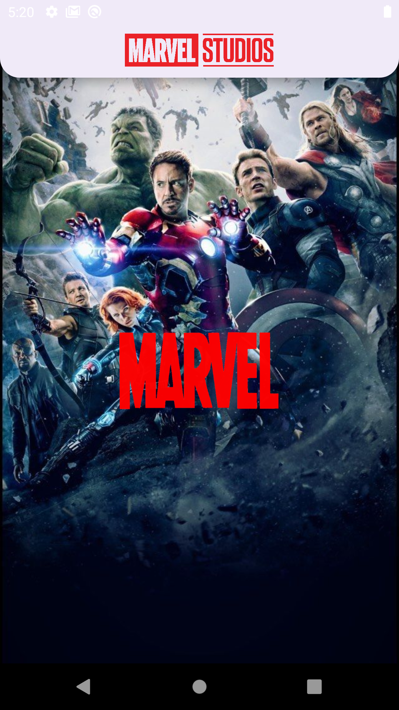
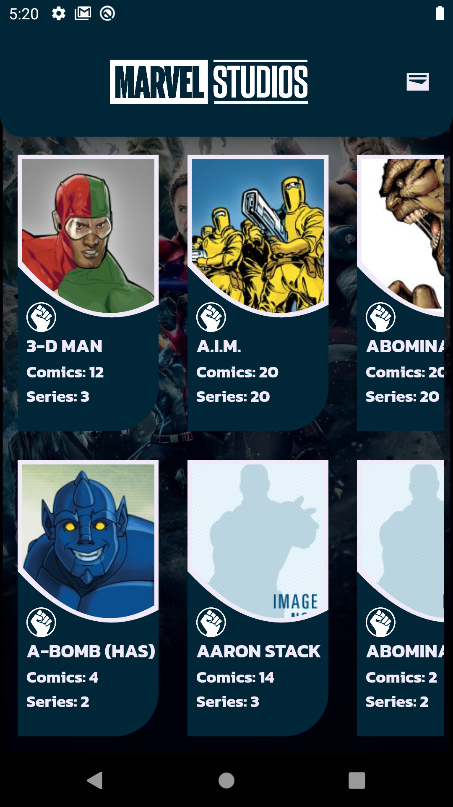
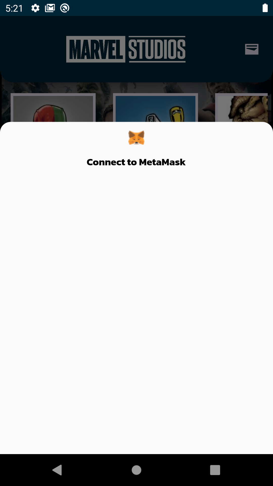
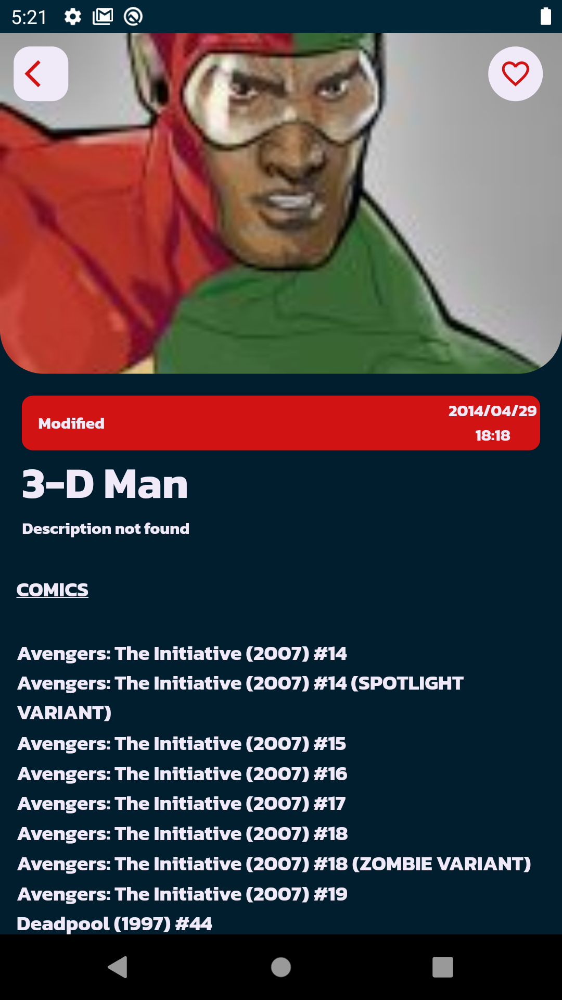
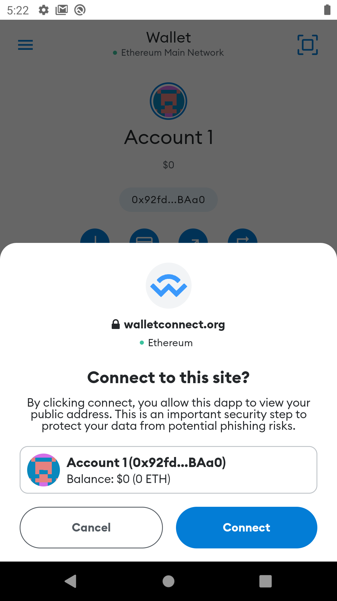
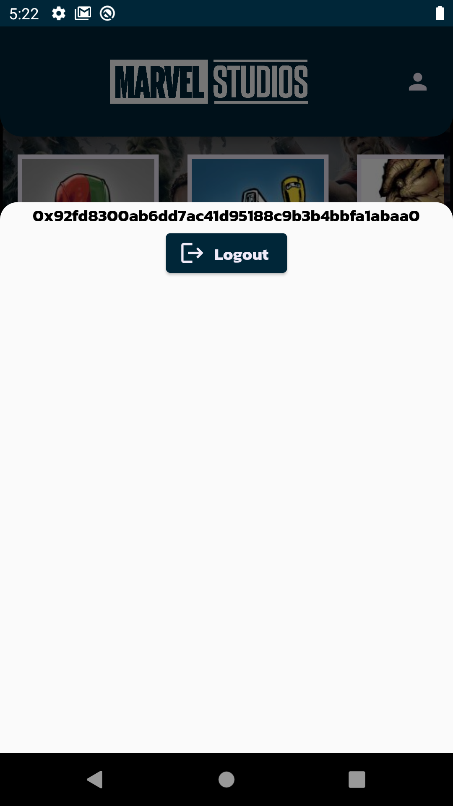

# marvelapp

A Mobile Application shows Marvel Characters and connect to MetaMask

## Steps and structure

- Created services and characters repository with marvel api keys and gethash convert with cyrpto library
- Created my character model
- Crated character bloc (state, event and bloc)
- Used bloc provider in main to injection character bloc within a subtree. And wrap it multi bloc provider to inject bloc more than one
- Created splash and home screen
- Wrap related widget with bloc builder to listen my states. and tested it.
- Designed splash, home and details screen
- Created button that opens modal sheet, on the appbar
- Created modal sheet screen and views
- Created wallet connect bloc
- Add wallet connect bloc to multi providers in main
- Wrap my button and wrap my modal sheet screen with wallet bloc by bloc builder

- The project structure is supported by models, screens, constants and services based on bloc and constant widgets.
  lib -> bloc, constants, model, repo, services, widgets

## Ekler

Herhangi bir ek bilgi buraya gelir

## Screenshots

